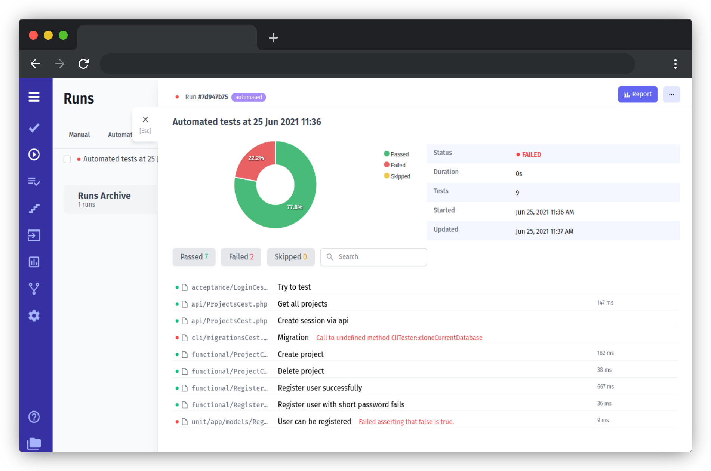

# Testomatio Reporter


👋 Hey, do you need some test reporting?

Testomat.io Reporter is a library that integrates with popular **JavaScript and TypeScript** test frameworks to provide a common interface for test reporting. By default, Testomat.io Reporter works with our reporting cloud service [Testomat.io Application](https://testomat.io), however it is not locked to it. Reporter can be used as a stanadlone tool to make test reports even if you don't use Testomat.io App.

## Features

Testomat.io Reporter (this npm package) supports:

* 🏄 Integarion with all popular [JavaScript/TypeScript frameworks](./docs/frameworks)
* 🗄️ Screenshots, videos, traces [uploaded into S3 bucket](./docs/artifacts)
* 🔎 Stack traces and error messages
* 🐙 [GitHub](./docs/pipes#github-pipe) & [GitLab](./docs/pipes#gitlab-pipe) integarion
* 🚅 Realtime reports
* 🗃️ Other test frameworks supported via [JUNit XML](./docs/junit.md)
* 💯 Free & open-source.
* 📊 Public and prviate Run reports on cloud via Testomat.io 👇




Testomatio Reporter provides common API to store and organize test reports.
It can receive test result data from any [test framework](./docs/frameworks) and send it to different services via [pipes](./docs/pipes).

| 🌊 Input         | 📊 Output                                 |
|---------------|----------------------------------------|
| Playwright    | Report on GitHub                       |
| Cypress       | Report on GitLab                       |
| Jest          | Report on [Testomat.io](https://testomat.io) |
| WebdriverIo   | ... your custom report   |
| CodeceptJS    |                                        |
| ....all others via JUnit format |                                  |

If you use multiple test frameworks and you need to use one customizable reporter, check Testomat.io Reporter, as you can adjust it once and attach it to all your projects.

## Architecture


## Installation

To enable testomatio reporter install `@testomatio/reporter` package


Use one of your favorite package managers:

```
npm install @testomatio/reporter --save-dev
```

```
pnpm install @testomatio/reporter --save-dev
```

```
yarn add @testomatio/reporter --dev
```


## Examples


You can refer sample tests from example folder of this repo. This is a basic example. If you need something full fledged you can refer this [example repo](https://github.com/testomatio/examples).

Add `@testomatio/reporter` package to your project:

```bash
npm i @testomatio/reporter --save
```

### Steps

👷‍♂️ *Work in progress...*

### Custom Properties

👷‍♂️ *Work in progress...*


### Debug logs
Pass `DEBUG` variable with module name e.g. `DEBUG=@testomatio/reporter:pipe:github`.
(Module name could be taken directly from the required module code).
To log all debug info pass `DEBUG=*`.