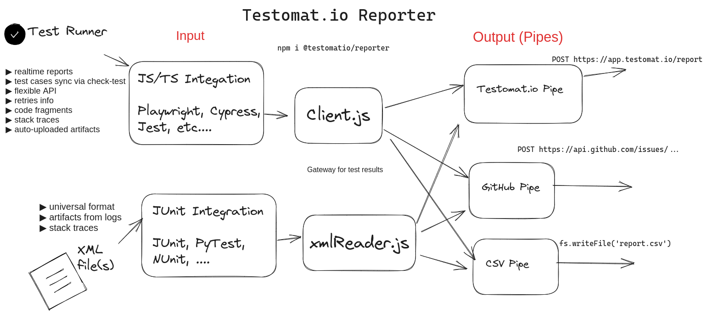
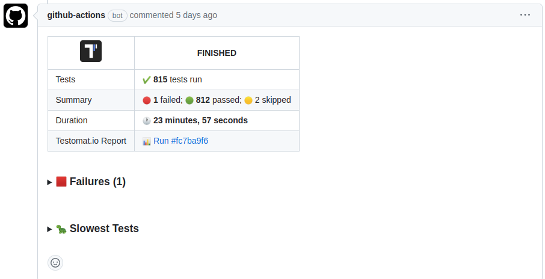

# Testomatio Reporter


👋 Hey, do you need some test reporting?

Testomat.io Reporter is a library that integrates with popular **JavaScript and TypeScript** test frameworks to provide a common interface for test reporting. By default, Testomat.io Reporter works with our reporting cloud service [Testomat.io App](https://testomat.io), however it is not locked to it. Reporter can be used as a stanadlone tool to make test reports even if you don't use Testomat.io App.

## Features

Testomat.io Reporter (this npm package) supports:

* 🏄 Integarion with all popular [JavaScript/TypeScript frameworks](./docs/frameworks.md)
* 🗄️ Screenshots, videos, traces [uploaded into S3 bucket](./docs/artifacts.md)
* 🔎 Stack traces and error messages
* 🐙 [GitHub](./docs/pipes.md#github-pipe) & [GitLab](./docs/pipes.md#gitlab-pipe) integarion
* 🚅 Realtime reports
* 🗃️ Other test frameworks supported via [JUNit XML](./docs/junit.md)
* 🚶‍♀️ Steps *(work in progress)*
* ☁️  Custom properties and metadata *(work in progress)*
* 💯 Free & open-source.
* 📊 Public and private Run reports on cloud via [Testomat.io App](https://testomat.io) 👇


## How It Works

Testomatio Reporter provides common API to store and organize test reports.
It can receive test result data from any [test framework](./docs/frameworks.md) and send it to different services via [pipes](./docs/pipes).

| 🌊 Input         | 📊 Output                                 |
|---------------|----------------------------------------|
| Playwright    | Report to GitHub                       |
| Cypress       | Report to GitLab                       |
| Jest          | Report to [Testomat.io](https://testomat.io) |
| ...   | ... your custom report   |

If you use multiple test frameworks and you need to use one customizable reporter, check Testomat.io Reporter, as you can adjust it once and attach it to all your projects.



Artifacts like screenshots, videos, traces, are **uploaded to your own cloud storage** via S3 protocol. Artifacts can be uplaoded privately or publicly, and used in reports.

## Installation

To enable testomatio reporter install `@testomatio/reporter` package


Use one of your favorite package managers:

```
npm install @testomatio/reporter --save-dev
```

```
pnpm install @testomatio/reporter --save-dev
```

```
yarn add @testomatio/reporter --dev
```

## Getting Started

### 1️⃣ **Attach reporter to the test runner you use:**

* ####  [Playwright](./docs/frameworks.md#playwright)
* #### [CodeceptJS](./docs/frameworks.md#CodeceptJS)
* #### [Cypress](./docs/frameworks.md#Cypress)
* #### [Jest](./docs/frameworks.md#Jest)
* #### [Mocha](./docs/frameworks.md#Mocha)
* #### [WebDriverIO](./docs/frameworks.md#WebDriverIO)
* #### [TestCafe](./docs/frameworks.md#TestCafe)
* #### [Detox](./docs/frameworks.md#Detox)
* #### [Newman (Postman)](./docs/frameworks.md#Newman)
* #### [JUnit](./docs/junit#junit)
* #### [NUnit](./docs/junit#nunit)
* #### [PyTest](./docs/junit#pytest)
* #### [PHPUnit](./docs/junit#phpunit)
* #### [Protractor](./docs/frameworks.md#protractor)

or any [other via JUnit](./docs/junit.md) report....

### 2️⃣ **Configure reports:**

* [Create report on Testomatio](./docs/pipes.md#testomatio-pipe).
* [Create brief summary report for GitHub Pull Request](./docs/pipes.md#github-pipe) 👇
* [Create breif summary report for GitLab Merge Request](./docs/pipes.md#gitlab-pipe).
* [Configure other pipes](./docs/pipes.md) for other ways to process test results output.

GitHub brief summary report published as a comment to Pull Request:




### 3️⃣ **Enable artifacts storage:**

Create bucket on AWS, Google Cloud, or any other cloud storage provider supporting S3 protocol. 
[Pass S3 credentials](./docs/artifacts.md) to reporter to enable artifacts uploading.

### 4️⃣ **Add it to CI Pipeline:**

After you tested reporter locally add it to your CI pipeline.

We prepared some [example workflows](./docs/workflows.md) that might help you to get it running.

---

🎉 **You are all set!**

Bring this reporter on CI and never lose test results again!


## Documentation

* 🛠️ [Frameworks](./docs/frameworks.md)
* ⛲ [Pipes](./docs/pipes.md)
* 📓 [JUnit](./docs/junit.md)
* 🗄️ [Artifacts](./docs/artifacts.md)
* 🔂 [Workflows](./docs/workflows.md)

## Development

### Debug Logs

To enable verbose logging run tests with `DEBUG` environment variable:

To print all reporter logs:

```
DEBUG=@testomatio/reporter:*
```
To print all reporter logs of a specific pipe:

```
DEBUG=@testomatio/reporter:pipe:github
```
